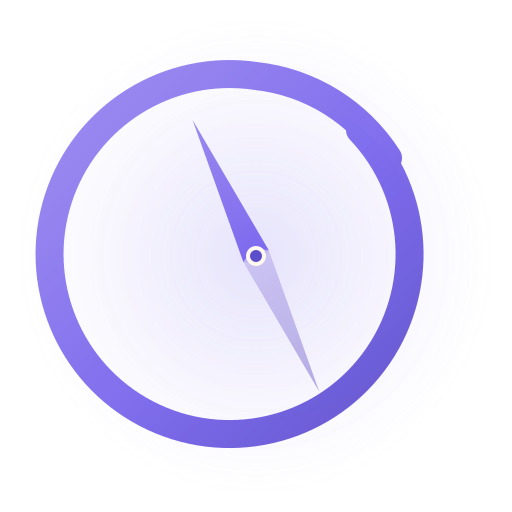

<p align="center">
  
</p>

<h1 align="center">Mindful Navigation</h1>

<p align="center">
  <em>A browser extension for intentional browsing.<br/>
  Pause, set an intention, then visit the sites that pull at your attention.</em>
</p>

<p align="center">
  
  
  
  
  
</p>

---

## The problem

You open a new tab to look something up. Twenty minutes later you're scrolling
through the same site you swore off last week, with no memory of the bridge in
between. Hard blockers feel like punishment and get disabled within a day.
Mindful Navigation takes the opposite stance: it doesn't block you, it *slows
you down just enough to remember you have a choice*.

## Features

- **Reflection pause** — a 30-second timer on the blocked domain, with the
  question "Do you really want to visit this site?". Buttons activate only
  after the countdown.
- **Intention setting** — write down what you actually came to do, then pick a
  bounded session length (5 / 15 / 30 / 60 minutes).
- **Time-boxed sessions** — the site is unblocked for the chosen window only.
- **Post-session reflection** — when time expires, you're asked whether you
  followed your intention, and given a clean exit or a new intention.
- **Calm UI** — a soft cream / lavender aesthetic, no harsh red blocking screens.
- **Local-only** — domain list and sessions are stored in `storage.local`. No
  servers, no telemetry.

## Screenshots

> _Coming soon — screenshots of the reflection overlay, intention form, and
> options page will land in `docs/` ahead of the store submission._

## Install

This release is loaded as a **temporary / unpacked extension** while store
submission is in progress.

```bash
git clone https://github.com/Asi0Flammeus/mindful-navigation.git
```

Then:

- **Firefox / Zen Browser** — open `about:debugging#/runtime/this-firefox`,
  click *Load Temporary Add-on*, pick `manifest.json`.
- **Chrome / Edge / Brave / Opera** — open `chrome://extensions`, enable
  *Developer mode*, click *Load unpacked*, pick the repo folder.

Full step-by-step and troubleshooting: see [INSTALL.md](INSTALL.md).

## Configuration

1. Click the extension icon in the toolbar → **Open Settings**.
2. Add the domains you want to mindfully gate (e.g. `youtube.com`,
   `reddit.com`, `x.com`). Suggested domains are one click away.
3. Visit one of those domains in a new tab to trigger the reflection overlay.

Domains and session state persist across browser restarts.

## How it works

| Stage | What happens |
|---|---|
| Navigation | `webRequestBlocking` intercepts the request to a configured domain and redirects to the in-extension blocking page. |
| Reflection | A 30-second countdown gates the *Yes / No* buttons. |
| Intention | If you proceed, you write the intention and pick a duration. |
| Session | The original URL is reopened; navigation to that domain is allowed for the duration. |
| End | The session expires and you're prompted to reflect, extend, or close. |

Manifest V2, vanilla JS, no build step. `browser-polyfill.js` smooths over
`browser` (Gecko) vs `chrome` (Blink) API differences.

## Project layout

```
manifest.json          extension manifest (MV2)
background.js          domain matching, session timers, request interception
content.js             overlay injection on already-open tabs
browser-polyfill.js    Mozilla WebExtension polyfill (Chrome compat)
popup/                 toolbar popup + blocking page
options/               settings page (domain list, suggested sites)
styles/overlay.css     shared overlay styling
icons/                 SVG source + rasterized PNG icons
```

## Contributing

Issues and pull requests welcome. Keep changes minimal and aligned with the
"calm by default" spirit:

- One feature per PR.
- No new build tooling unless there's a strong reason.
- No telemetry, no remote calls.
- Match the existing zen / cream visual language.

## License

[MIT](LICENSE) — do what you want, no warranty.

---

<sub>Logo and release docs cleaned and packaged with the help of Claude Code.</sub>
